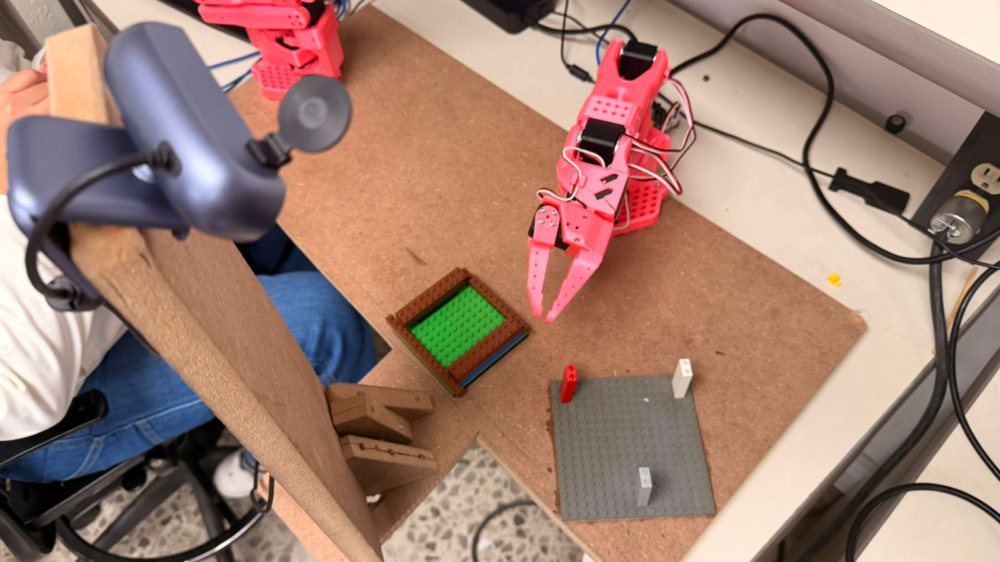
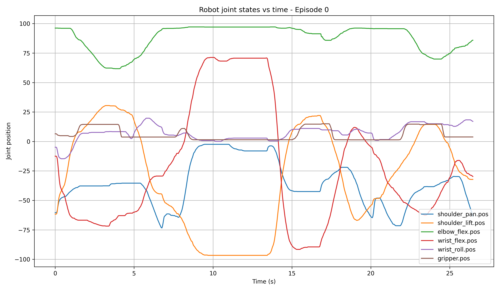
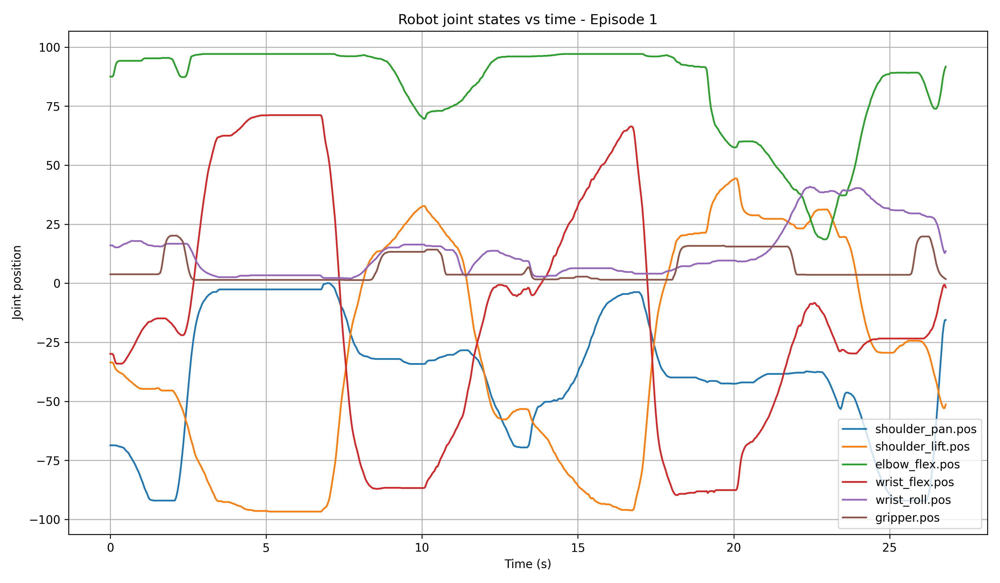

# TE3002B.101 - Final Project Report

## Development Team
- Arturo Balboa
- Oscar de la Rosa
- Angel Hernandez
- Emiliano Niño
- Rigoberto Soto

## Executive Summary
This project presents a robotic manipulation system designed for the autonomous disassembly of a LEGO column using an SO101 leader-follower setup. The proposed solution combines visual perception, imitation learning, and robot control to identify the target object, grasp it, transport it, and place it in a designated storage area.

The implementation is built on the LeRobot framework and integrates a YOLO-based detector with an ACT (Action Chunking Transformer) policy. The system was trained from expert demonstrations collected during teleoperated executions of the task and evaluated under different workspace conditions.



## 1. Project Context
The objective of the project is to enable the SO101 robot to perform a complete manipulation sequence in a structured workspace: detect the LEGO column, approach it, grasp it, remove it from its initial position, transport it, and release it in a storage area without human intervention.

The task is relevant because it combines perception and control under natural variability in object placement, camera viewpoint, and lighting conditions. In practice, the robot must operate from visual observations and its own state information, which makes the problem suitable for data-driven control policies.

## 2. Problem Statement and Hypothesis
**Problem statement:** determine whether the SO101 robot can learn to detect, disassemble, and store a LEGO column from expert demonstrations while maintaining consistent performance when the object appears in different positions within the workspace.

**Hypothesis:** if the SO101 robot is trained with expert demonstrations and uses a YOLO-based detection model to localize the LEGO column, then it will be able to reproduce the disassembly and storage task autonomously, even when the object appears in positions not observed during training.

## 3. Objective
Develop an ACT-based control policy capable of detecting, disassembling, and storing a LEGO column autonomously by combining visual information with the robot state.

## 4. Experimental Setup
The experimental setup consists of two bases and a workspace camera:

- The first base holds the LEGO column in its initial position.
- The second base acts as the storage or destination area.
- The camera observes both bases so that the system can detect the object and execute the pick-and-place sequence.

This arrangement allows the robot to identify the target object, plan the grasp, and complete the transfer under a controlled but non-trivial scenario.

## 5. Dataset
The dataset was collected with the SO101 leader-follower configuration provided by LeRobot. During data acquisition, an operator manually executed the full task while the system recorded observations and actions.

A total of approximately 250 demonstrations were collected. After reviewing the trajectories, the 50 highest-quality demonstrations were selected for the final dataset. Each demonstration includes:

- RGB camera observations.
- Robot joint state information.
- Gripper state information.
- Action trajectories executed during the task.

The dataset was published on Hugging Face:

https://huggingface.co/datasets/emiliano-ng/SO101

## 6. Methodology
The proposed solution is composed of two main blocks: perception and policy learning.

First, a YOLO detector localizes the LEGO column in the workspace. The detector is implemented through a Darknet wrapper and is used to extract a compact feature vector from the image stream. The observed object information is then combined with robot state data to form the input representation for the control policy.

Second, the collected demonstrations are used to train an ACT policy within the LeRobot framework. The policy learns to reproduce the manipulation behavior observed in the dataset and outputs the next action chunk required to continue the task.

Training progress and metrics were monitored with Weights & Biases (WandB) to track loss evolution and learning stability. The presentation reports a training run of 100,000 steps, while the repository README originally documented a 10,000-step training configuration.

The trained model was published on Hugging Face:

https://huggingface.co/emiliano-ng/SO101_Model

## 7. System Architecture
The system follows a simple perception-to-control pipeline:

1. The RGB camera captures the workspace.
2. YOLO detects the LEGO column and relevant workspace objects.
3. The detector outputs a fixed-length feature vector.
4. The robot state and visual features are fed to the ACT policy.
5. The policy predicts the next action sequence.
6. The SO101 follower executes the action in the physical workspace.

In the repository, this flow is supported by the following components:

- [scripts/recorder.py](scripts/recorder.py) records demonstrations and appends YOLO features to LeRobot observations.
- [scripts/yolo_extract.py](scripts/yolo_extract.py) performs YOLO inference and feature extraction.
- [scripts/darknet_detect.py](scripts/darknet_detect.py) loads the Darknet backend through ctypes.
- [scripts/lerobot_dataset_config.py](scripts/lerobot_dataset_config.py) defines the observation keys used by the dataset.

## 8. Experimental Design
The experimentation process considered both dataset quality and task robustness.

### Training stage
- 250 demonstrations were collected.
- 50 high-quality trajectories were selected.
- The ACT policy was trained using the selected demonstrations.
- Metrics were monitored during training to verify convergence.

### Variability in the dataset
- Demonstrations were captured at different times of day.
- The workspace included natural lighting variations.
- The LEGO column appeared in different initial positions.

### Evaluation stage
- New object positions were tested.
- YOLO was used to validate detection.
- The grasp, transport, and storage phases were evaluated separately.

## 9. Results
The presentation reports the following execution results:

- Pick success rate: 4/10 = 40%.
- Place success rate: 8/10 = 80%.
- Overall success rate: 63%.

Qualitatively, the system demonstrated the ability to detect the object, execute the grasp, and complete several successful placements. The results also show that the place phase was more reliable than the pick phase, which suggests that object localization and grasp initiation remain the main sources of error.

### Robot State Trajectory Analysis

To support the evaluation of demonstration quality and trajectory behavior, the robot joint states were extracted from the recorded Parquet dataset and plotted over time. Each plot shows one complete demonstration episode.

The raw trajectory information is stored in the `data/` folder, including the original Parquet file used for analysis. The generated trajectory plots are stored in the `readme_images/` folder, where additional episode figures are also available for inspection.

The plotted state variables correspond to the six SO101 joint positions:

- `shoulder_pan.pos`
- `shoulder_lift.pos`
- `elbow_flex.pos`
- `wrist_flex.pos`
- `wrist_roll.pos`
- `gripper.pos`

These plots help visualize how the robot configuration changes during the task. Since each episode represents one complete recorded demonstration, the trajectories can be used to inspect movement smoothness, repeatability, and consistency across demonstrations.

#### Episode 0



#### Episode 1



The state trajectories show the evolution of the robot joints during the manipulation sequence. Although the episodes follow a similar task structure, the trajectories are not fully smooth. The sharp changes in several joints indicate manual corrections, abrupt movements, or variability in the demonstrations, which may affect the stability and generalization of the learned policy.

Additional episode plots are included in the `readme_images/` folder, while the raw data used to generate them remains available in the `data/` folder for reproducibility.

## 10. Feasibility and Limitations
The project is feasible with the available SO101 hardware, camera, and self-collected demonstrations. The current system already integrates perception, learning, and robot control in a complete pipeline.

The main limitations identified in the presentation are the following:

- The dataset is limited and was collected manually.
- Small camera movements have a strong impact on performance.
- The model does not yet generalize well to other colors or object positions.
- Training times were long and restricted the number of tests that could be performed.

## 11. Future Work
The next development steps should focus on improving robustness and generalization:

- Expand the dataset with different camera positions.
- Add more object classes.
- Increase the number of demonstrations.
- Make the robot motion slower and safer.
- Reduce sensitivity to camera angle.
- Test different base positions in the workspace.

## 12. Repository Structure
- `backup/`: YOLO weight files and training checkpoints.
- `custom_cfg/`: Darknet configuration, class names, and data files.
- `data/`: raw recorded dataset information, including the Parquet trajectory data used for state analysis.
- `libs/`: external Darknet library files.
- `readme_images/`: setup image and generated robot state trajectory plots for different demonstration episodes.
- `scripts/`: recording, detection, and dataset utilities.

## 13. Installation
The project depends on LeRobot and the Darknet-based YOLO detector.

```bash
pip install git+https://github.com/huggingface/lerobot@1396b9fab7aecddd10006c33c47a487ffdcb54b4
```

Before running the YOLO utilities, build Darknet with OpenCV support and place `libdarknet.so` inside `libs/`.

## 14. Reference Figures
The presentation material is consistent with the following visual sections in the repository:

- System setup: [readme_images/Setup1.jpeg](readme_images/Setup1.jpeg)
- Robot state trajectory episode 0: [readme_images/states_episode_0.png](readme_images/states_episode_0.png)
- Robot state trajectory episode 1: [readme_images/states_episode_1.png](readme_images/states_episode_1.png)
- Additional robot state trajectory episodes are available in the `readme_images/` folder.
- Raw trajectory data is available in the `data/` folder.

## 15. Conclusion
This project demonstrates a complete experimental pipeline for autonomous LEGO column disassembly using the SO101 platform. The combination of YOLO-based perception, LeRobot data collection, and ACT policy learning provides a viable foundation for more robust manipulation experiments. Although the current performance is still limited by dataset size and camera sensitivity, the results confirm that the approach is technically sound and can be extended with more data and better calibration.

